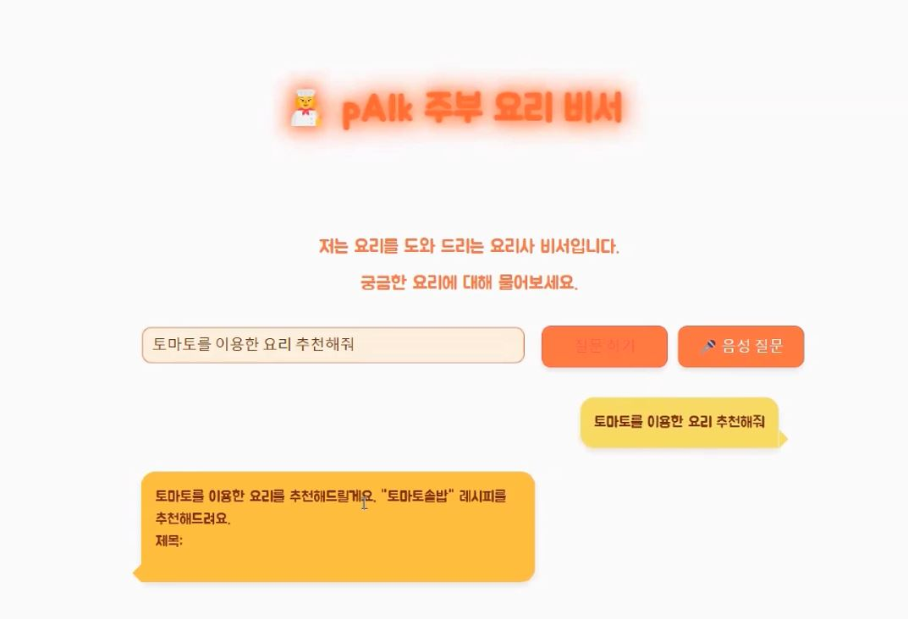
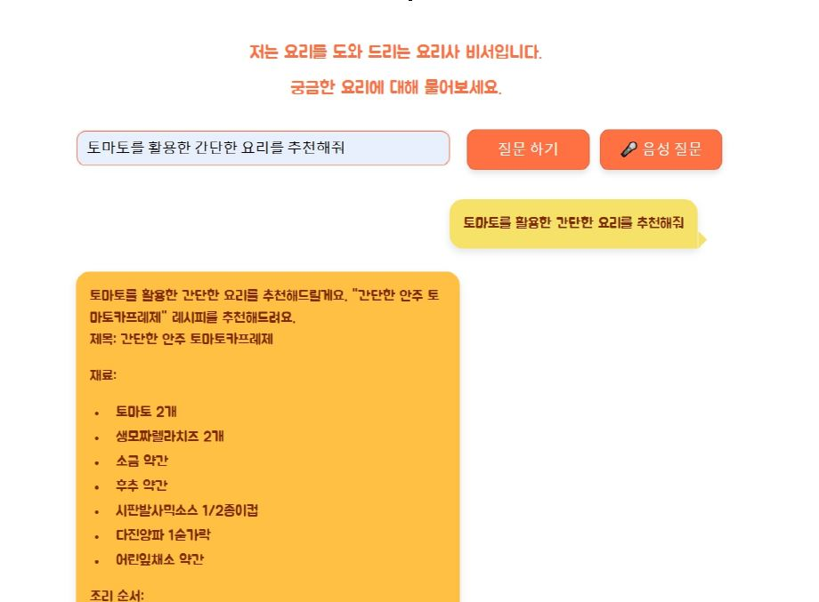
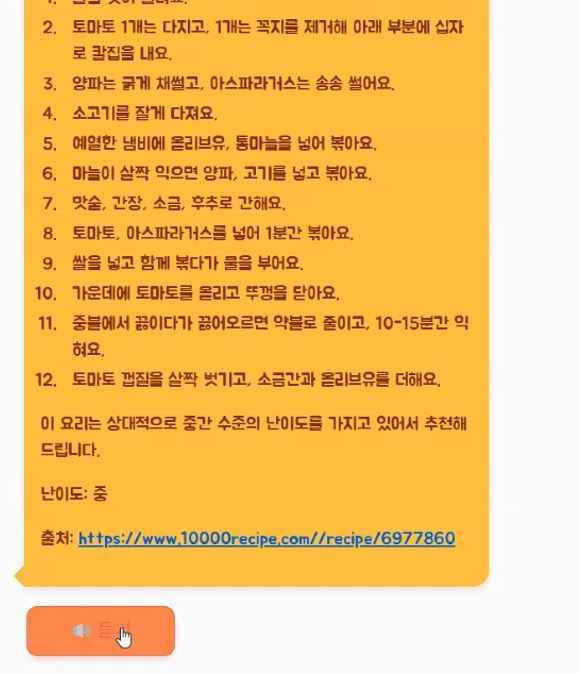

# pAIk 주부 요리 비서

## 프로젝트 소개
사용자의 요청에 맞춰 적절한 음식을 추천하고 레시피를 안내하는 챗봇 프로젝트입니다. 이 챗봇은 LLM(대형 언어 모델) 튜닝을 통해 사용자의 요구에 맞춘 응답을 제공하며, 다양한 데이터 소스를 활용하여 레시피와 요리 정보를 제공합니다.

  
  

## 주요 기능
- **음식 추천**: 사용자 요청에 맞춰 적합한 음식을 추천.
- **레시피 안내**: 재료, 조리 시간, 난이도 등을 고려하여 맞춤형 레시피 제공.
- **챗 메모리 기능**: 대화를 통한 자연스러운 상호작용 지원.
- **STT/TTS 기능**: 음성 인식 및 텍스트 변환 기능으로 음성을 이용한 상호작용 가능.

## 주요 목표
- **학습 측면**: LLM 파인튜닝 및 RAG 기능을 포함한 챗봇 구현.
- **서비스 측면**: 사용자 요청에 맞춘 맞춤형 음식 추천 및 레시피 안내 기능 제공.

## 개발 환경
- **언어 및 프레임워크**: Python, Streamlit
- **도구**: KakaoTalk, VSCode, Google Colab

## 프로젝트 상세 내용

### 데이터 수집 및 전처리
- **데이터 수집**: 만개의 레시피(5,600개) 데이터 크롤링 (Selenium, BeautifulSoup 활용).
- **데이터 전처리**:
  - 텍스트 전처리: 정규식을 사용하여 특수 문자 제거.
  - 난이도 컬럼 추가: Qwen 2.5-3B-IT 모델을 사용해 난이도 생성 후 Vector DB에 임베딩.
  - Fine-tuning을 위해 Instruction 및 Output 추가.

### LLM 튜닝
- **기본 모델 선정**: Recurrent Gemma-2B, Qwen 2.5-3B-IT 모델을 테스트 후 Qwen 모델 선택.
- **Fine-tuning**:
  - KOpen-platypus 데이터셋과 레시피 데이터 2,000건을 사용해 총 3,500개의 데이터를 LoRA 적용하여 3 epoch 학습.
  - 기본 모델의 성능이 충분히 우수하여 튜닝에 의한 차이는 미미함.
- **Instruction-tuning**:
  - 총 24,926개 데이터로 4 epoch 학습 후 결과 미흡 → IT 모델 사용 결정.

### 챗봇 + RAG 구현 및 서빙
- **챗봇 구현**: OpenAI API를 활용해 기본 챗봇 파이프라인 구축.
- **RAG 구현**: RAG 파이프라인 구축 및 테스트.
- **테스트 LLM 및 벡터 DB**:
  - **LLM**: gpt-4o-mini, llama3.1, llama3.2, gemma2, mistral-small, phi3, qwen2.5 등 다양한 모델 테스트.
  - **Embedding 모델**: text-embedding-ada-002, text-embedding-3-small, mxbei-mxbai-embed-large 등 사용.
  - **Vector DB**: FAISS.

## 기능 구현

### 기본 프론트엔드 구현
- **Frontend**: Streamlit을 활용해 기본 챗 인터페이스 및 RAG 기능 구현.

### 추가 기능
- **챗 메모리 기능 추가**: 자연스러운 대화 유도.
- **STT/TTS 기능 추가**: 음성을 통한 조리법 안내 제공.
  - **라이브러리 변경**: pyttsx3에서 gTTS와 SpeechRecognition으로 전환하여 더 자연스러운 음성 구현.

## 프로젝트 의의 & 개선안

### 프로젝트 의의
- LLM 튜닝을 통한 챗봇과 서빙의 완벽한 구현.
- 초기에 설정했던 목표 달성 및 STT/TTS 기능 추가 구현.

### 부족했던 점 및 향후 개선 방안
- 상업적 활용을 위해 데이터 출처 문제 해결 필요.
- 모델 튜닝과 데이터셋 추가를 통해 실질적 개선 필요.
- Streamlit 연동 실패 원인 파악 및 수정.
- vllm 등의 라이브러리를 활용하여 인퍼런스 성능 개선.
- 이미지 및 영상 데이터를 추가하여 UX 개선.
- FastAPI 등을 통해 프론트엔드를 확장하고 UI 개선.
